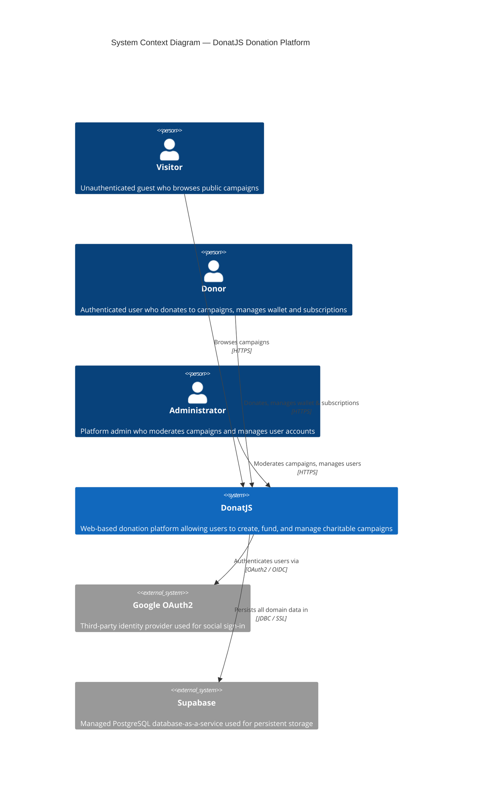
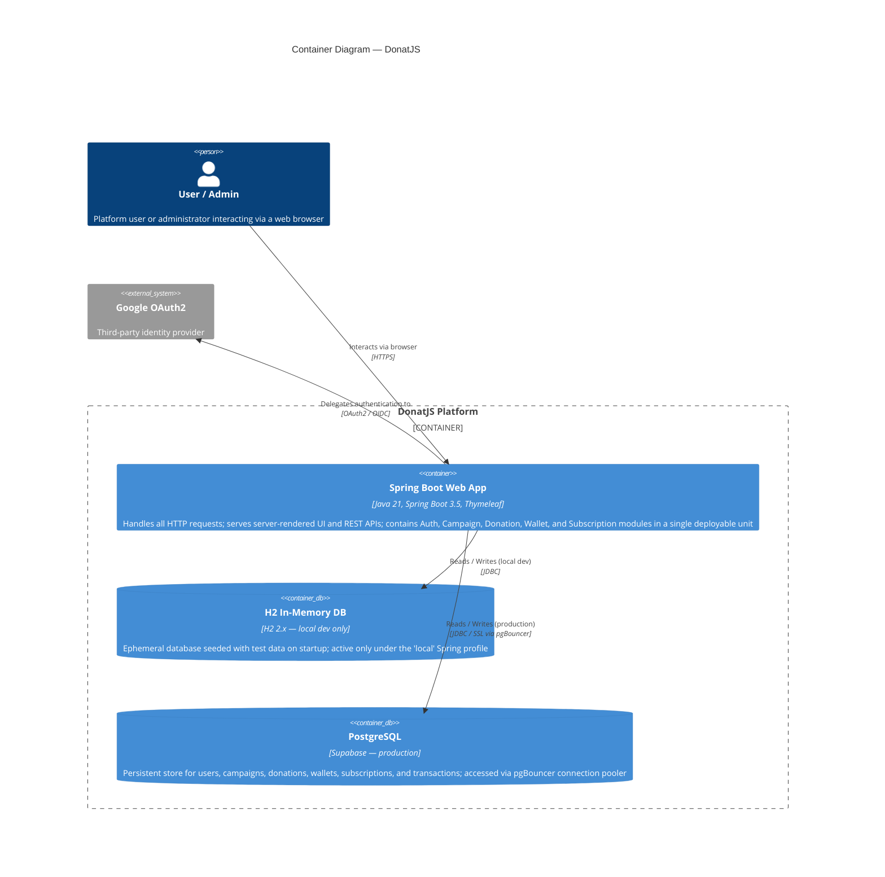
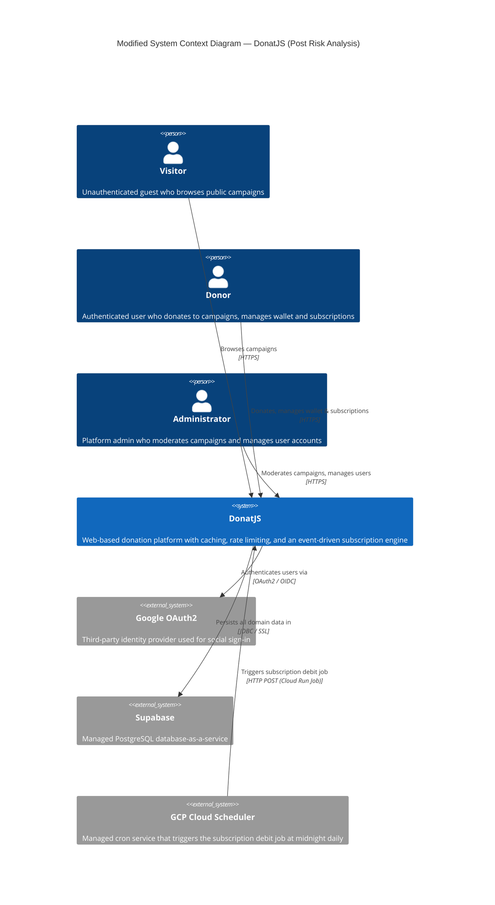
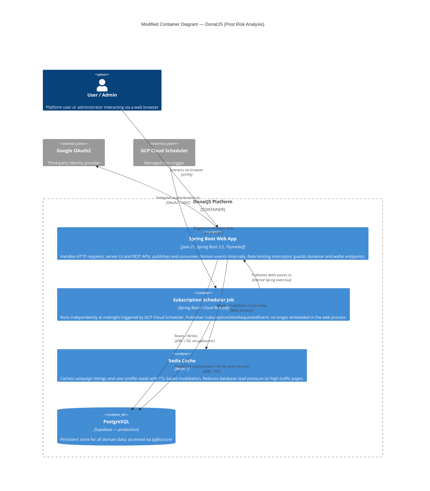

# DonatJS — Software Architecture

**Project:** DonatJS — Web-based Donation Platform
**Repository:** https://github.com/KKI-Group-5/donatjs
**Stack:** Java 21 · Spring Boot 3.5 · Thymeleaf · PostgreSQL (Supabase) · GCP Cloud Run

---

## 1. Current Architecture (Deliverable G.1)

### 1.1 System Context Diagram (C4 Level 1)

> **Purpose:** Shows DonatJS in relation to its users and external systems.



**Nodes:**
| Element | Type | Description |
|---------|------|-------------|
| Visitor | Person | Unauthenticated guest; can only browse OPEN campaigns |
| Donor | Person | Authenticated user; can donate, subscribe, top up wallet |
| Administrator | Person | Can approve/reject campaigns and manage user accounts |
| DonatJS | System (in scope) | The donation platform being described |
| Google OAuth2 | External System | Social sign-in provider |
| Supabase | External System | Managed PostgreSQL + pgBouncer |

**Relationships:**
- Visitor → DonatJS: HTTPS (read-only browsing)
- Donor → DonatJS: HTTPS (full platform interactions)
- Administrator → DonatJS: HTTPS (moderation actions)
- DonatJS → Google OAuth2: OAuth2/OIDC (user authentication delegation)
- DonatJS → Supabase: JDBC/SSL (all persistent reads and writes)

---

### 1.2 Container Diagram (C4 Level 2)

> **Purpose:** Shows the internal containers that make up DonatJS and how they communicate.



**Containers inside DonatJS Platform:**
| Container | Technology | Role |
|-----------|------------|------|
| Spring Boot Web App | Java 21, Spring Boot 3.5, Thymeleaf | Monolithic web app handling all requests; houses 5 feature modules |
| H2 In-Memory DB | H2 2.x | Local-only ephemeral database (Spring profile: `local`) |
| PostgreSQL (Supabase) | PostgreSQL 15 + pgBouncer | Production persistent database (Spring profile: `supabase`) |

**Internal Modules inside the Web App:**
- **Auth & User Profile** — OAuth2, email/password login, profile management
- **Campaign Management** — create, edit, moderate, lifecycle (OPEN → CLOSED/CANCELLED)
- **Donation Management** — create donations, enforce 5M IDR limit, update campaign total
- **Wallet** — balance management, deposits, withdrawals, transaction history
- **Saved Campaigns & Subscriptions** — save campaigns, subscribe with daily/weekly/monthly debits

---

### 1.3 Deployment Diagram

> **Purpose:** Shows where each container runs in production and how code reaches there.

```mermaid
C4Deployment
    title Deployment Diagram — DonatJS

    Deployment_Node(devmachine, "Developer Machine", "Windows / macOS / Linux") {
        Deployment_Node(jvm_local, "JVM 21", "Eclipse Temurin 21") {
            Container(app_local, "DonatJS App", "Spring Boot JAR", "Active Spring profile: local")
        }
        Deployment_Node(h2_node, "H2 Engine (in-process)", "H2 2.x") {
            ContainerDb(db_local, "H2 In-Memory DB", "H2", "Seeded test data; destroyed on restart")
        }
    }

    Deployment_Node(github, "GitHub", "github.com/KKI-Group-5/donatjs") {
        Deployment_Node(actions, "GitHub Actions", "ubuntu-22.04 runners") {
            Container(pipeline, "CI/CD Pipeline", "ci.yml + cd.yml", "Runs tests → builds Docker image → pushes to Artifact Registry → deploys to Cloud Run on push to main or staging")
        }
    }

    Deployment_Node(gcp, "Google Cloud Platform") {
        Deployment_Node(artifact, "Artifact Registry", "GCP Artifact Registry") {
            Container(image, "Docker Image", "eclipse-temurin:21-jre", "Multi-stage build: JDK 21 builder → JRE 21 runtime")
        }
        Deployment_Node(cloudrun, "Cloud Run", "Managed serverless container runtime") {
            Container(app_prod, "DonatJS App", "Spring Boot JAR", "Active Spring profile: supabase; auto-scales to zero on idle; PORT injected by Cloud Run")
        }
    }

    Deployment_Node(supabase_node, "Supabase", "Managed cloud service") {
        ContainerDb(pg, "PostgreSQL + pgBouncer", "PostgreSQL 15", "Production database with connection pooling optimised for Cloud Run's ephemeral connections")
    }

    Rel(pipeline, artifact, "Pushes Docker image", "docker push")
    Rel(artifact, cloudrun, "Pulls and runs image on deploy", "Cloud Run deploy")
    Rel(app_prod, pg, "Queries via pgBouncer", "JDBC / SSL")
```

**Deployment environments:**
| Environment | Runtime | Database | Trigger |
|-------------|---------|----------|---------|
| Local dev | JVM 21 on developer machine | H2 in-memory | Manual (`./gradlew bootRun`) |
| CI | GitHub Actions ubuntu-22.04 | None (test-only) | Push / PR to any branch |
| Production | GCP Cloud Run (auto-scaling) | Supabase PostgreSQL | Push to `main` or `staging` |

**CI/CD flow:**
1. Developer pushes to `main` or `staging`
2. GitHub Actions runs `./gradlew clean test`
3. On success: `docker build` → multi-stage JDK→JRE image
4. `docker push` to GCP Artifact Registry
5. `gcloud run deploy` pulls new image → zero-downtime rollout

---

## 2. Future Architecture — Post Risk Analysis (Deliverable G.2)

### 2.1 Modified System Context Diagram

> **Change from current:** GCP Cloud Scheduler is added as an external actor that triggers the now-independent Subscription Scheduler Job.



**New element vs. current context:**
| Element | Change | Reason |
|---------|--------|--------|
| GCP Cloud Scheduler | New external system | Subscription Scheduler is extracted to a Cloud Run Job triggered externally; no longer an `@Scheduled` bean inside the web process |

---

### 2.2 Modified Container Diagram

> **Changes from current:** Redis Cache added, Subscription Scheduler extracted to a separate container, Rate Limiter middleware added to the web app.



**New/changed containers vs. current:**
| Container | Status | Description |
|-----------|--------|-------------|
| Redis Cache | New | Caches campaign listings; reduces DB load |
| Subscription Scheduler Job | Extracted | Moved out of web process; triggered by Cloud Scheduler |
| Spring Boot Web App | Modified | Rate limiting interceptor added; Subscription→Wallet call replaced by event |

---

## 3. Risk Analysis & Architecture Modification Justification (Deliverable G.3)

DonatJS is currently built as a Spring Boot monolith where all five business modules — Authentication, Campaign Management, Donation Management, Wallet, and Subscription — share a single JVM process and a single PostgreSQL instance on Supabase. While this architecture accelerated development and kept the CI/CD pipeline simple, it carries several risks at scale. The most critical is a single point of failure: an uncaught exception in any module, or a memory leak in the Subscription Scheduler running at midnight, will take down the entire platform simultaneously. Inter-module coupling is also inconsistent — the platform already uses Spring's event-driven mechanism for profile updates (`ProfileUpdatedEvent`) and rejection notifications (`RejectedDonationEvent`), but the Subscription-to-Wallet debit path uses a direct synchronous `WalletService.deductBalance()` call, creating tight coupling between two modules that should be independent. Additionally, there is no caching layer, so every campaign listing request hits the database directly, and sensitive endpoints such as `/api/donations` have no rate limiting, exposing them to potential abuse or accidental flooding.

The proposed modified architecture addresses these risks through four targeted additions that do not require breaking the monolith into microservices. First, a Redis Cache container is introduced to serve campaign listing and user profile reads, with TTL-based invalidation on writes, which is expected to reduce database read queries by 60–80% on the most heavily trafficked pages. Second, a Spring `HandlerInterceptor` backed by Redis counters is added to enforce per-user rate limits on donation and wallet top-up endpoints. Third, the `SubscriptionService`-to-`WalletService` direct call is refactored into a `SubscriptionDebitRequestedEvent`, aligning the module boundary with the event-driven design already used elsewhere in the codebase. Fourth, and most importantly, the Subscription Scheduler is extracted from the web process into a dedicated Cloud Run Job triggered by GCP Cloud Scheduler, so midnight batch processing no longer competes with HTTP request threads for JVM resources.

These changes preserve the core architectural principle — a single Spring Boot deployable — while meaningfully improving resilience, scalability, and module independence. The event-driven refactor of the Subscription-Wallet path completes the boundary model the team established in earlier milestones, making each module independently testable without reaching across service interfaces. The tradeoff is modest operational complexity: Redis and the Cloud Run Job are two additional infrastructure components, but both are fully managed GCP services that integrate cleanly with the existing Cloud Run deployment and GitHub Actions CD pipeline, requiring only minimal additions to the `cd.yml` workflow.

---

## Appendix — Risk Summary Table

| Risk | Severity | Addressed By |
|------|----------|-------------|
| Single point of failure (monolith crashes all modules) | High | Extracted Scheduler Job reduces blast radius; future: further decomposition |
| Tight Subscription→Wallet coupling (direct service call) | High | Refactored to `SubscriptionDebitRequestedEvent` |
| No rate limiting on donation/wallet endpoints | High | Rate-limiting `HandlerInterceptor` + Redis counters |
| No caching for high-read campaign listings | Medium | Redis Cache with TTL invalidation |
| Scheduler competes with HTTP threads at midnight | Medium | Scheduler extracted to independent Cloud Run Job |
| Dev/prod environment gap (H2 vs PostgreSQL) | Medium | Mitigated by `application-supabase.properties`; no structural change needed |
| Google OAuth2 single external auth dependency | Low | Email/password login available as fallback; no change |
