README for DonatJS.

## Getting Started (Local Development)

Zero-setup. Clone, then:

```bash
./gradlew bootRun          # macOS / Linux
./gradlew.bat bootRun      # Windows (PowerShell or cmd)
```

Open <http://localhost:8080> and log in with either demo account:

| Role  | Email                | Password     |
|-------|----------------------|--------------|
| User  | `test@donatjs.com`   | `password123`|
| Admin | `admin@donatjs.com`  | `admin123`   |

What happens under the hood:

- The `local` Spring profile is active by default — uses an in-memory H2 database
  (PostgreSQL compatibility mode) that is seeded with a test user, admin user,
  wallets with starter balances, demo campaigns, a donation, a saved campaign
  and a sample subscription every time you boot.
- H2 console is live at <http://localhost:8080/h2-console>
  (JDBC URL `jdbc:h2:mem:donatjsdb`, user `sa`, empty password).
- OAuth (Google) is wired up with placeholder credentials — the form login
  works out of the box; to exercise Google sign-in, set `GOOGLE_CLIENT_ID`
  and `GOOGLE_CLIENT_SECRET` in a `.env` file.

### Running against Supabase / production DB

When `SPRING_PROFILES_ACTIVE=supabase` is set (or the deployment target sets
it for you), the app reads `DB_URL`, `DB_USERNAME`, `DB_PASSWORD` from the
environment and applies pgBouncer-safe Hikari tuning plus HTTPS-only cookies.
See `src/main/resources/application-supabase.properties`.

### Running the test suite

```bash
./gradlew test
./gradlew jacocoTestReport     # coverage in build/reports/jacoco/test/html/
```

### Project layout

| Module                         | Highlights                                                                     |
|--------------------------------|---------------------------------------------------------------------------------|
| Authentication & User Profile  | `AuthController`, `ProfileService`, `CurrentUserService`, `ProfileUpdatedEvent` |
| Application Wallet             | `WalletServiceImpl`, `WalletApiController` (internal API for donations)         |
| Donation Management            | `DonationService` (5 M limit → REJECTED/SUCCESS, wallet debit, campaign update) |
| Campaign Management            | `SimpleCampaignService` (moderation, admin edit, total-raised aggregate)        |
| Saved Campaign & Subscription  | `SavedCampaignServiceImpl`, `SubscriptionService` (daily/weekly/monthly)        |

---

## Architecture

### Current Architecture (Deliverable G.1)

#### System Context Diagram

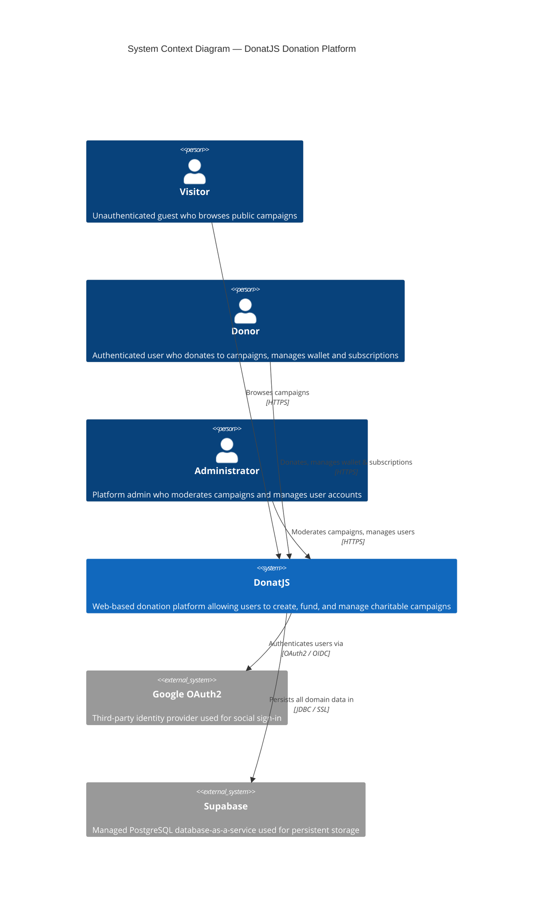

#### Container Diagram

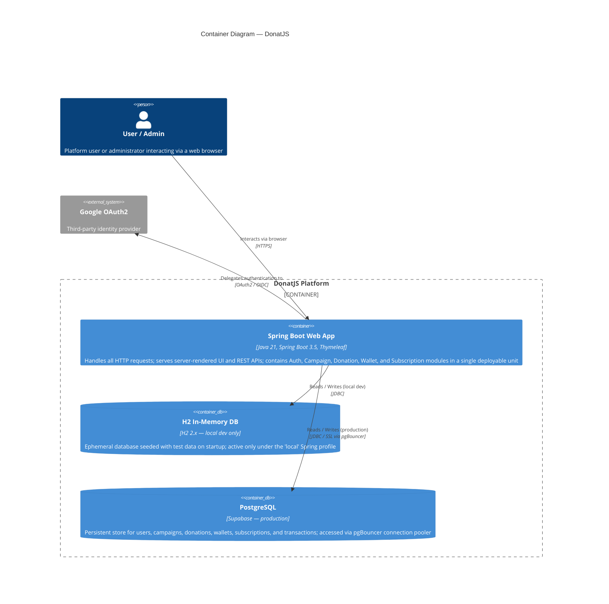

#### Deployment Diagram

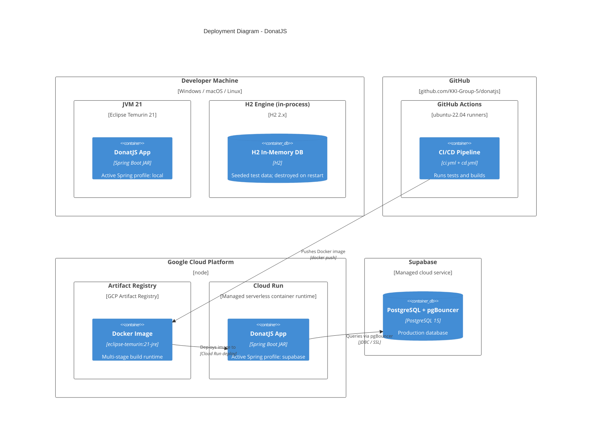

---

### Future Architecture — Post Risk Analysis (Deliverable G.2)

#### Modified System Context Diagram

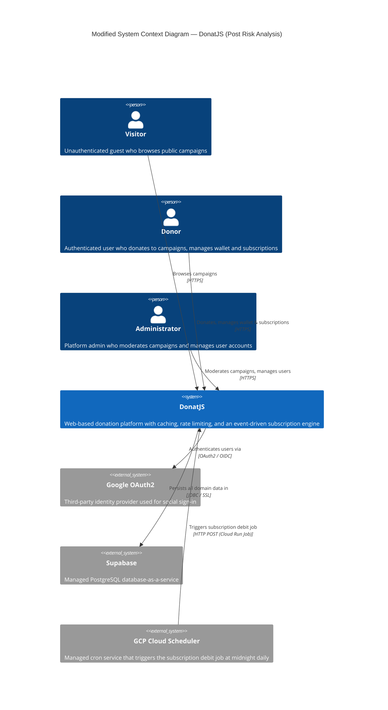

#### Modified Container Diagram

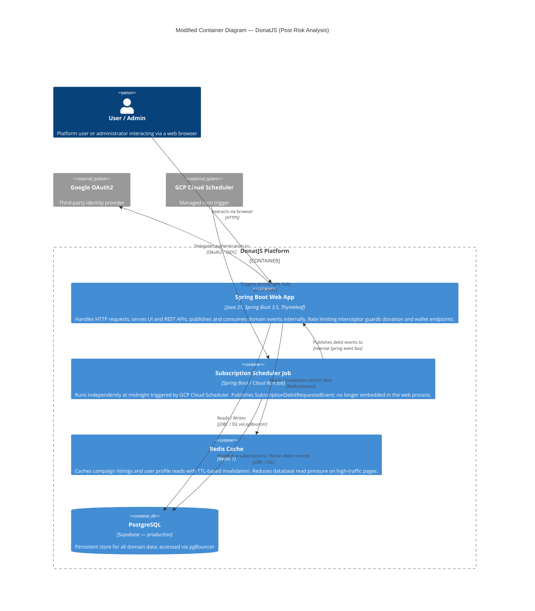

---

### Risk Analysis & Architecture Modification Justification (Deliverable G.3)

DonatJS is currently built as a Spring Boot monolith where all five business modules — Authentication, Campaign Management, Donation Management, Wallet, and Subscription — share a single JVM process and a single PostgreSQL instance on Supabase. While this architecture accelerated development and kept the CI/CD pipeline simple, it carries several risks at scale. The most critical is a single point of failure: an uncaught exception in any module, or a memory leak in the Subscription Scheduler running at midnight, will take down the entire platform simultaneously. Inter-module coupling is also inconsistent — the platform already uses Spring's event-driven mechanism for profile updates (`ProfileUpdatedEvent`) and rejection notifications (`RejectedDonationEvent`), but the Subscription-to-Wallet debit path uses a direct synchronous `WalletService.deductBalance()` call, creating tight coupling between two modules that should be independent. Additionally, there is no caching layer, so every campaign listing request hits the database directly, and sensitive endpoints such as `/api/donations` have no rate limiting, exposing them to potential abuse or accidental flooding.

The proposed modified architecture addresses these risks through four targeted additions that do not require breaking the monolith into microservices. First, a Redis Cache container is introduced to serve campaign listing and user profile reads, with TTL-based invalidation on writes, which is expected to reduce database read queries by 60–80% on the most heavily trafficked pages. Second, a Spring `HandlerInterceptor` backed by Redis counters is added to enforce per-user rate limits on donation and wallet top-up endpoints. Third, the `SubscriptionService`-to-`WalletService` direct call is refactored into a `SubscriptionDebitRequestedEvent`, aligning the module boundary with the event-driven design already used elsewhere in the codebase. Fourth, and most importantly, the Subscription Scheduler is extracted from the web process into a dedicated Cloud Run Job triggered by GCP Cloud Scheduler, so midnight batch processing no longer competes with HTTP request threads for JVM resources.

These changes preserve the core architectural principle — a single Spring Boot deployable — while meaningfully improving resilience, scalability, and module independence. The event-driven refactor of the Subscription-Wallet path completes the boundary model the team established in earlier milestones, making each module independently testable without reaching across service interfaces. The tradeoff is modest operational complexity: Redis and the Cloud Run Job are two additional infrastructure components, but both are fully managed GCP services that integrate cleanly with the existing Cloud Run deployment and GitHub Actions CD pipeline, requiring only minimal additions to the `cd.yml` workflow.

---

### Tutorial B (Individual Work)

#### Detailed Container Diagram

This diagram focuses on the **Authentication & User Profile** module's placement within the DonatJS ecosystem and its external dependencies.

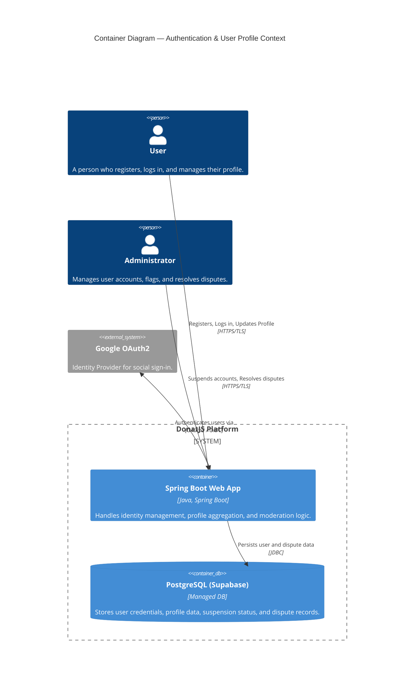

#### Component Diagram

The following diagram breaks down the internal components of the **Authentication & User Profile** module within the Spring Boot application.

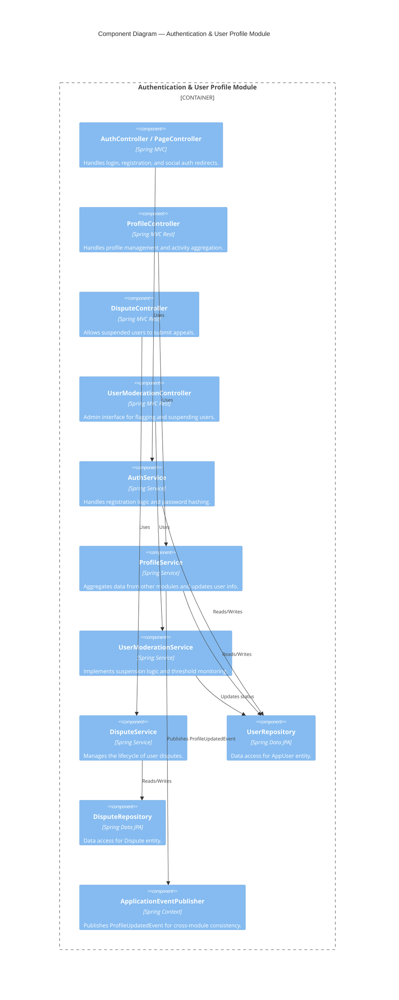

#### Code Diagrams

##### 1. Class Diagram: Core Domain & Services
This diagram illustrates the relationship between the core entities and services within the module.

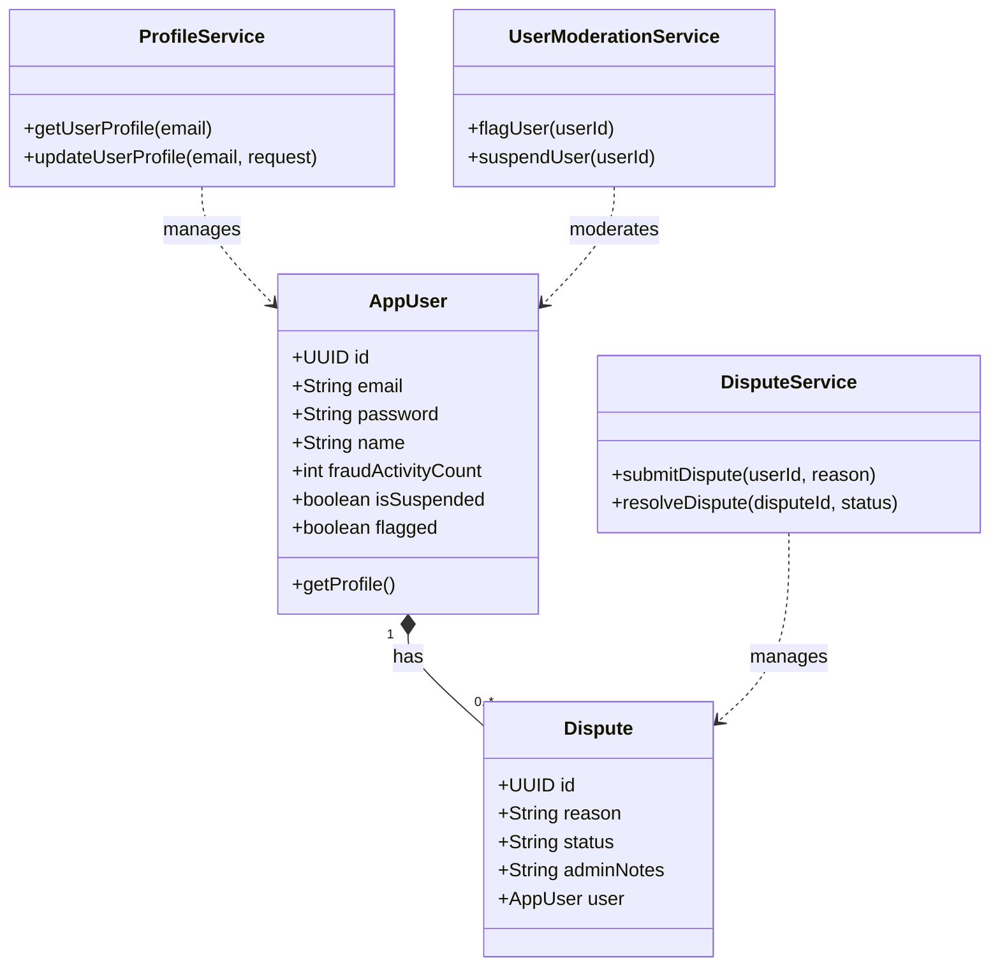

##### 2. Sequence Diagram: Profile Update Event Flow
This demonstrates the asynchronous communication between the User Profile module and other modules when a profile is updated.

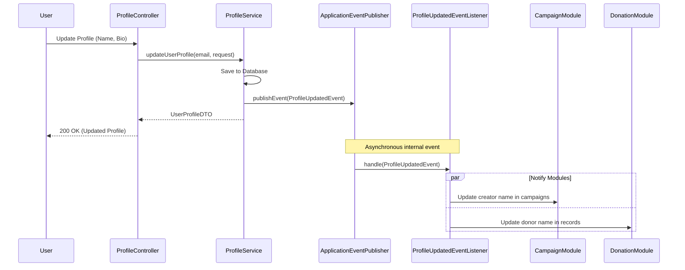

##### 3. Sequence Diagram: Authentication with Google OAuth2
This illustrates the flow when a user authenticates via a third-party identity provider.

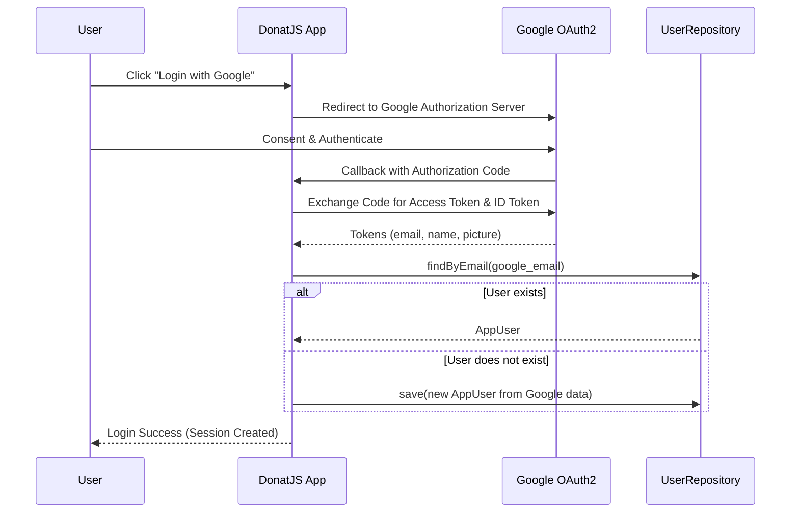

##### 4. Sequence Diagram: Dispute Appeal Process
This shows how a suspended user can appeal their status and how an admin resolves it.

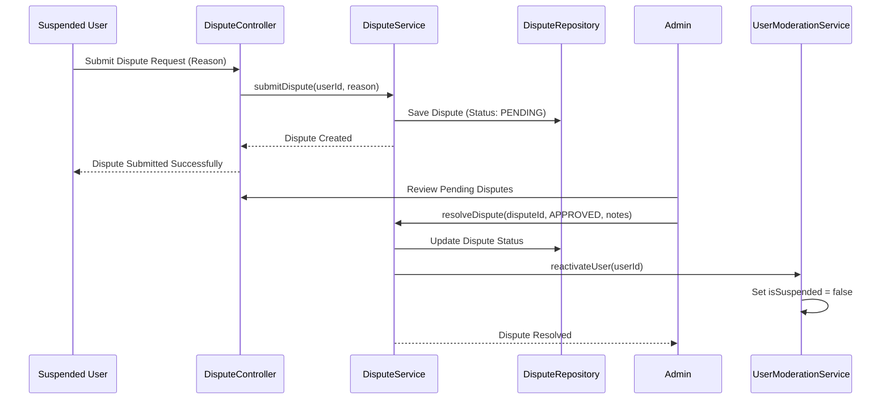

## Work Plan & Milestones
This project is divided into 5 main milestones. The tasks below detail the development plan for each module. Please add your specific module tasks and assign a Person In Charge (PIC) for each item.

### Milestone 1: Preparation (Due Feb 20)
**Focus:** Initial setup, CI/CD, and basic integration slice. 
* [ ] **Authentication & User Profile:** Set up the module repository, database schemas, and establish the CI/CD pipeline. 
* [ ] **Authentication & User Profile:** Implement the basic account creation endpoint using email, password, name, date of birth, and bio to demonstrate database integration. 
* [ ] **Authentication & User Profile:** Implement the basic login mechanism allowing users to authenticate into the system. 

### Milestone 2: 25% Progress (Due March 6)
**Focus:** Core feature functionality and continuous deployment readiness. 
* [ ] **Authentication & User Profile:** Implement the features allowing users to view and update their profile information. 
* [ ] **Authentication & User Profile:** Integrate third-party authentication logic (e.g., Google login) as an alternative login method. 
* [ ] **Authentication & User Profile:** Establish access control so unauthenticated guests can view campaigns but are redirected when attempting donations. 

### Milestone 3: 50% Progress
**Focus:** Inter-module communication and secondary features. 
* [ ] **Authentication & User Profile:** Build the endpoints to aggregate and display the user's campaign activities, donations, and subscriptions on their profile. 
* [ ] **Authentication & User Profile:** Implement the asynchronous communication pipeline so profile updates reflect immediately in Campaign and Donation modules without disrupting user activities. 
* [ ] **Authentication & User Profile:** Create the base data structure to receive incoming updates regarding a user's FRAUD/REJECTED activity from the Campaign and Donation modules. 

### Milestone 4: 75% Progress
**Focus:** Complex logic, subscriptions, and asynchronous processes. 
* [ ] **Authentication & User Profile:** Implement the threshold logic to flag user accounts if their combined total of rejected campaigns and donations reaches 3 or more. 
* [ ] **Authentication & User Profile:** Build the automated notification system that sends flagged account details to admins for review. 
* [ ] **Authentication & User Profile:** Implement the Admin action endpoints to suspend accounts and block them from creating campaigns, making donations, or topping up wallets. 

### Milestone 5: 100% Progress (Final)
**Focus:** Edge cases, bulk actions, and final polish. 
* [ ] **Authentication & User Profile:** Implement the dispute feature allowing suspended users to appeal their suspension to the admins. 
* [ ] **Authentication & User Profile:** Finalize integration testing to ensure consistent data reference across all modules whenever identity data is queried. 
* [ ] **Authentication & User Profile:** Conduct final edge-case testing, resolve remaining bugs, and ensure the module meets all code quality standards and 100% test coverage. 
## Work Plan & Milestones

This project is divided into 5 main milestones. The tasks below detail the development plan for the **Application Wallet** module.

### Milestone 1: Preparation (Due Feb 20)
**Focus:** Initial setup and basic integration slice.
* [ ] Create `Wallet` and `Transaction` Entities.
* [ ] Implement a basic endpoint to view a dummy wallet balance to prove Database -> Backend -> Frontend integration.

### Milestone 2: 25% Progress (Due March 6)
**Focus:** Core CRUD operations and independent module functionality.
* [ ] Implement the "View Wallet Balance" use case for authenticated users.
* [ ] Implement the "View Wallet Transaction History" use case.
* [ ] Build the UI/Frontend pages for the Wallet dashboard and transaction history.

### Milestone 3: 50% Progress
**Focus:** Inter-module communication and secondary features.
* [ ] Implement the "Withdraw Funds" use case, including withdrawal notifications and balance deduction.
* [ ] Create the internal API/Service layer to allow the **Donation Module** to deduct balances when a user makes a donation.
* [ ] Ensure balance never goes negative during standard donation deductions.

### Milestone 4: 75% Progress
**Focus:** Complex logic, subscriptions, and asynchronous processes.
* [ ] Implement automatic subscription debits.
* [ ] Create the logic to send an immediate notification if a user's balance is insufficient for an upcoming subscription debit.
* [ ] Establish the event-driven communication (or API structure) to listen for Campaign status changes (specifically `CANCELLED` or failed deadlines).

### Milestone 5: 100% Progress (Final)
**Focus:** Edge cases, bulk actions, and final polish.
* [ ] Implement the automatic bulk refund mechanism for when a campaign fails to reach its target or is cancelled.
* [ ] Ensure campaigns with a `FRAUD` status *do not* trigger automatic refunds, per system constraints.
* [ ] Final UI/UX polish, bug fixing, and ensuring 100% test coverage for wallet services.
## Work Plan & Milestones
This project is divided into 5 main milestones. The tasks below detail the development plan for each module.

### Milestone 1: Preparation (Due Feb 20)
Focus: Initial setup, CI/CD, and basic integration slice.
* [ ] Saved Campaign & Subscription: Design database schemas for `SavedCampaign` and `Subscription` models to handle recurring donation periods.
* [ ] Saved Campaign & Subscription: Define API communication contracts for receiving status updates from the Campaign and Wallet modules.
* [ ] Saved Campaign & Subscription: Set up the initial repository structure ensuring integration with the group's CI/CD pipeline.

### Milestone 2: 25% Progress (Due March 6)
Focus: Integration between frontend, backend, and database for core module features.
* [ ] Saved Campaign & Subscription: Implement the "Save" and "Remove" campaign functionality for authenticated users.
* [ ] Saved Campaign & Subscription: Build the frontend view for users to see their list of saved campaigns.
* [ ] Saved Campaign & Subscription: Establish the basic integration demonstrating data flow from frontend to database for the "Save" feature.

### Milestone 3: 50% Progress
Focus: Inter-module communication and secondary features.
* [ ] Saved Campaign & Subscription: Develop the Subscription engine logic for daily, weekly, and monthly donation periods.
* [ ] Saved Campaign & Subscription: Integrate with the Wallet module to enforce the "Internal Wallet Only" payment constraint for subscriptions.
* [ ] Saved Campaign & Subscription: Implement UI and backend logic for changing subscription durations or canceling active subscriptions.

### Milestone 4: 75% Progress
Focus: Complex logic, subscriptions, and asynchronous processes.
* [ ] Saved Campaign & Subscription: Build the automated email trigger for campaigns on a user's favorite list that reach 98% of their target.
* [ ] Saved Campaign & Subscription: Implement the "Automatic Termination" logic to stop subscriptions if a campaign is deleted or fails.
* [ ] Saved Campaign & Subscription: Develop the confirmation warning and automatic debiting system for new subscriptions.

### Milestone 5: 100% Progress (Final)
Focus: Edge cases, bulk actions, and final polish.
* [ ] Saved Campaign & Subscription: Implement "Insufficient Balance" notification logic for failed subscription debits.
* [ ] Saved Campaign & Subscription: Finalize asynchronous consistency to ensure saved data reflects campaign status changes without interrupting other user activities.
* [ ] Saved Campaign & Subscription: Complete final unit testing and technical design justification for the module's architecture.
## Work Plan & Milestones

This project is divided into 5 main milestones. The tasks below detail the development plan for each module. 


### Milestone 1: Preparation (Due Feb 20)

**Focus:** Initial setup, CI/CD, and basic integration slice.

* [ ] **Donation Management:** Set up the initial Spring Boot repository including the basic `Campaign` entity and `LandingController` for the integration slice. **(PIC: Khayru)**

* [ ] **Donation Management:** Create the basic HTML view to prove frontend-backend-database integration runs locally without errors. **(PIC: Khayru)**

* [ ] **Donation Management:** Implement and verify the dummy CI/CD GitHub Actions script to satisfy the preparation deadline constraints. **(PIC: Khayru)**


### Milestone 2: 25% Progress (Due March 6)

**Focus:** Basic CRUD, database transition, and AWS Deployment.

* [ ] **Donation Management:** Implement the core backend endpoint for users to create a donation record by entering an amount and adding notes[cite: 96]. **(PIC: Khayru)**

* [ ] **Donation Management:** Add payment method selection logic, ensuring bank methods incur a Rp 1,500 fee and digital/e-wallets incur a Rp 2,000 fee[cite: 97, 98]. **(PIC: Khayru)**

* [ ] **Donation Management:** Deploy the working API to AWS, completing the delayed Continuous Deployment (CD) requirement for the Even 2025/2026 semester[cite: 403]. **(PIC: Khayru)**


### Milestone 3: 50% Progress

**Focus:** Inter-module communication and secondary features.

* [ ] **Donation Management:** Build validation logic to enforce a maximum donation limit of 5 million rupiah, setting the status to REJECTED if exceeded or SUCCESS if valid[cite: 103, 104, 106]. **(PIC: Khayru)**

* [ ] **Donation Management:** Develop the system notification feature to alert admins when a user makes a REJECTED donation, including the donation details[cite: 105]. **(PIC: Khayru)**

* [ ] **Donation Management:** Integrate with the Campaign module to ensure the campaign's total funds are consistently updated when a SUCCESS donation is recorded[cite: 94, 108]. **(PIC: Khayru)**


### Milestone 4: 75% Progress

**Focus:** Complex logic, subscriptions, and asynchronous processes.

* [ ] **Donation Management:** Create the API endpoints and frontend views for authenticated users to view their list of past donations on their profile[cite: 100]. **(PIC: Khayru)**

* [ ] **Donation Management:** Implement the logic to display the total accumulated donations on the specific campaign details page[cite: 101]. **(PIC: Khayru)**

* [ ] **Donation Management:** Integrate with the Wallet module so that donations correctly calculate and notify the wallet to deduct the appropriate balance[cite: 109, 117]. **(PIC: Khayru)**


### Milestone 5: 100% Progress (Final)

**Focus:** Edge cases, bulk actions, and final polish.

* [ ] **Donation Management:** Implement restriction logic ensuring users cannot manually withdraw their donations, routing withdrawal requests to require admin approval[cite: 93]. **(PIC: Khayru)**

* [ ] **Donation Management:** Finalize the "update donation record" functionality [cite: 99] and verify donations halt if a campaign status is no longer OPEN[cite: 92]. **(PIC: Khayru)**

* [ ] **Donation Management:** Conduct final integration testing across User Profile, Campaign, and Wallet modules to ensure data consistency without direct component calls[cite: 151, 157]. **(PIC: Khayru)**

**Focus:** Initial setup, CI/CD, and basic integration slice.
* [ ] **Campaign Management :** Define campaign lifecycle (statuses, transitions, and rules)
* [ ] **Campaign Management :** Design database schema, API endpoints, and service event interactions
* [ ] **Campaign Management :** Create ERD and state transition diagram

### Milestone 2: 25% Progress (Due March 6)
**Focus:** 
* [ ] **Campaign Management :** Implement campaign creation and viewing (public shows OPEN campaigns only)
* [ ] **Campaign Management :** Implement user actions (edit description and delete before donations)
* [ ] **Campaign Management :** Add validation for deadline, target amount, and required fields

### Milestone 3: 50% Progress
**Focus:** Inter-module communication and secondary features.
* [ ] **Campaign Management :** Implement admin moderation (approve, reject, admin edit)
* [ ] **Campaign Management :** Integrate donation events to update total raised and detect target reached
* [ ] **Campaign Management :** Enforce permission rules and prevent invalid operations

### Milestone 4: 75% Progress
**Focus:** Complex logic, subscriptions, and asynchronous processes.
* [ ] **Campaign Management :** Implement deadline automation (CLOSED if success, CANCELLED if failed)
* [ ] **Campaign Management :** Trigger payout and refund events to wallet service
* [ ] **Campaign Management :** Handle fraud cases and send notification events

### Milestone 5: 100% Progress (Final)
**Focus:** Edge cases, bulk actions, and final polish.
* [ ] **Campaign Management :** Handle concurrency and late-event edge cases
* [ ] **Campaign Management :** Add logging, monitoring, and reliability handling
* [ ] **Campaign Management :** Final integration testing and documentation
